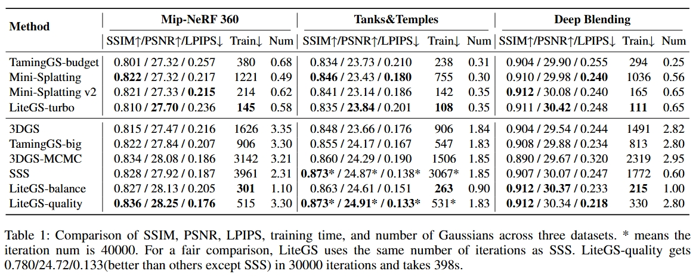
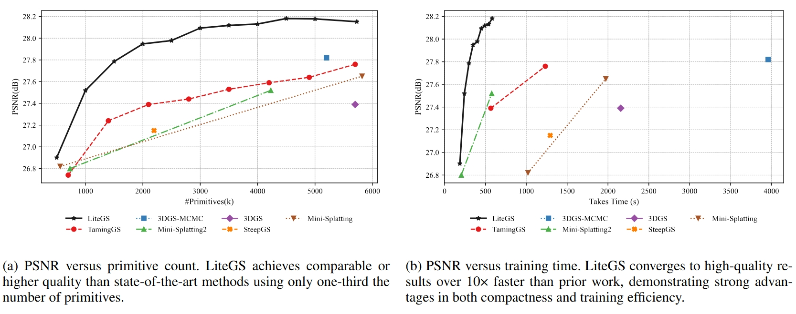

# LiteGS

在LiteGS基础上的工作室采集预处理系统


https://arxiv.org/abs/2503.01199

https://github.com/MooreThreads/LiteGS


**最快（约 50 秒）、模块化，且支持纯 Python 或 CUDA 调用**

本仓库提供了一个重构的代码库，旨在提高高斯泼溅（Gaussian Splatting）的灵活性和性能。

## 在约 50 秒内训练 3DGS

`python ./scripts/full_eval_fast.py --mipnerf360 SOURCE_PATH1 --tanksandtemples SOURCE_PATH2 --deepblending SOURCE_PATH3`

|场景|基元数量|耗时 (RTX 3090)|耗时 (RTX 4090)|SSIM_训练|PSNR_训练|LPIPS_训练|SSIM_测试|PSNR_测试|LPIPS_测试|
|---|---|---|---|---|---|---|---|---|---|
|bicycle|1360000|68.90290451049805|**41.72691751**|0.7696665|23.9320354|0.2501733|0.7585854|25.1978111|0.2335179|
|flowers|1220000|78.57123351097107|**47.9060986**|0.7225419|23.1023922|0.2838508|0.6053527|21.7142277|0.3396027|
|garden|1460000|78.55829739570618|**46.76381636**|0.8845506|28.7087154|0.1193212|0.8556744|27.3950653|0.1323125|
|stump|1340000|71.96337366104126|**44.23456001**|0.8554742|28.5616417|0.2056226|0.7926696|27.2177505|0.2127895|
|treehill|1160000|74.03676867485046|**46.34997225**|0.7261154|22.7449684|0.3029707|0.6390569|22.8510647|0.3379321|
|room|800000|70.27747488|**41.05782461**|0.9351271|33.6474419|0.2011591|0.9221826|31.5905571|0.2149457|
|counter|800000|89.81700301170349|**51.63395095**|0.9220967|29.9026985|0.1850652|0.9086227|28.8188915|0.2000091|
|kitchen|1200000|105.24096488952637|**63.1258564**|0.9389035|32.4555969|0.1205899|0.9264742|31.4408417|0.1294753|
|bonsai|1200000|91.47094392776489|**56.54596996**|0.9501833|32.8006744|0.1922134|0.9444824|31.9543724|0.1964863|
|truck|680000|61.99935531616211|**40.03852582**|0.8910525|26.4909763|0.1484901|0.8747544|25.3993835|0.1531686|
|train|720000|69.77397298812866|**46.26339579**|0.8102806|23.553236|0.2373699|0.7795711|21.1193752|0.2538348|
|drjohnson|1600000|66.38695478439331|**39.18569803**|0.9353783|34.0604973|0.2259799|0.9080961|29.6174507|0.2518271|
|playroom|980000|56.96188426017761|**32.52357793**|0.9448828|35.7014847|0.2159965|0.9150408|30.9205952|0.2443539|

## 背景
高斯泼溅（Gaussian Splatting）是一种广泛应用于计算机图形学和视觉领域的强大技术。它通过将 3D 数据表示为空间中的高斯分布，从而实现对空间数据的高效且准确的表示。然而，原版 PyTorch 实现（https://github.com/graphdeco-inria/gaussian-splatting）存在以下局限性：

1. 前向和后向计算被封装在两个不同的 PyTorch 扩展函数中。虽然这种设计显著加速了训练，但除非修改底层的 C 代码，否则无法访问中间变量。
2. 修改算法的任何步骤都需要手动推导梯度公式并在后向传播中实现，这增加了极大的复杂性。

## 特性

1. **模块化设计**：重构后的代码库将前向和后向过程拆分为多个 PyTorch 扩展函数，显著提高了模块化程度，并使访问中间变量变得更加容易。此外，在某些情况下，利用 PyTorch Autograd 可以免去手动推导梯度公式的麻烦。

2. **灵活性**：LiteGS 提供了两套模块化 API——一套由 CUDA 实现，另一套由 Python 实现。基于 Python 的 API 支持直接修改计算逻辑，无需具备 C 代码开发经验，从而实现快速原型开发。此外，Python API 通过对张量维度进行置换，保持了极具竞争力的训练速度。对于性能要求极高的任务，CUDA API 则支持完全自定义。

3. **更好的性能与更少的资源占用**：LiteGS 比原版 3DGS 实现快了 4.7 倍，同时减少了约 30% 的显存占用。这些优化在不牺牲灵活性或可读性的前提下提高了训练效率。

4. **算法保留**：LiteGS 保留了核心的 3DGS 算法，仅因聚类（clustering）对训练逻辑进行了细微调整。

## 快速入门

1. 安装 simple-knn
    ```bash
    pip install litegs/submodules/simple-knn
    ```

2. 安装 fused-ssim
    ```bash
    pip install litegs/submodules/fused_ssim
    ```
    

3. 安装 litegs_fused
    
    ```bash
    pip install litegs/submodules/gaussian_raster
    ```

    如果需要 CMake 项目（例如在 Visual Studio 中进行 CUDA 调试）：

    ```bash
    cd litegs/submodules/gaussian_raster
    mkdir ./build
    cd ./build
    # Windows PowerShell: $env:CMAKE_PREFIX_PATH = (python -c "import torch; print(torch.utils.cmake_prefix_path)")
    export CMAKE_PREFIX_PATH=$(python -c "import torch; print(torch.utils.cmake_prefix_path)")
    cmake ../
    cmake --build . --config Release
    ```

4. 安装依赖

    ```bash
    pip install -r requirement.txt
    ```
    
### 训练
使用以下命令开始训练：

`./example_train.py --sh_degree 3 -s DATA_SOURCE -i IMAGE_FOLDER -m OUTPUT_PATH`

## 更快地运行

下面展示了 LiteGS 使用 Mip-NeRF 360 数据集在 RTX 3090 上的训练结果。使用的训练和评估命令为：

LiteGS-turbo:
`python ./scripts/full_eval_fast.py --mipnerf360 SOURCE_PATH1 --tanksandtemples SOURCE_PATH2 --deepblending SOURCE_PATH3`

LiteGS:
`python ./full_eval.py --mipnerf360 SOURCE_PATH1 --tanksandtemples SOURCE_PATH2 --deepblending SOURCE_PATH3`






## 模块化

与原版 3DGS 不同（原版几乎将整个渲染过程封装在单个 PyTorch 扩展函数中），LiteGS 将该过程划分为多个模块化函数。这种设计允许用户直接通过 Python 脚本访问中间变量并集成自定义计算逻辑，而无需修改 C 代码。LiteGS 的渲染过程分为以下步骤：

1. **簇剔除 (Cluster Culling)**
    
    LiteGS 将高斯点分为若干块（chunk），每块包含 1,024 个点。渲染流水线的第一步是视锥剔除，过滤掉相机视野之外的点。

2. **簇压缩 (Cluster Compact)**
    
    类似于网格渲染，LiteGS 在视锥剔除后对可见基元进行压缩。可见点的每个属性都被重新组织到连续内存中，以提高处理效率。

3. **3DGS 投影**
    
    在此步骤中，高斯点被投影到屏幕空间，与原版 3DGS 实现相比没有变化。

4. **创建可见性表 (Create Visibility Table)**
    
    此步骤创建一个可见性表，将图块（tiles）映射到其可见基元，从而支持后续阶段的高效并行处理。

5. **光栅化 (Rasterization)**
    
    在最后一步，每个图块并行地对其可见基元进行光栅化，确保了极高的计算效率。

LiteGS 对密度控制进行了微调，以适应其基于聚类的方法。

## 灵活性

`gaussian_splatting/wrapper.py` 文件包含两套 API，支持在 Python 实现和 CUDA 实现之间灵活切换。基于 Python 的 API 通过 `call_script()` 调用，而基于 CUDA 的 API 则通过 `call_fused()` 使用。虽然 CUDA API 提供了显著的性能提升，但灵活性较低。选择哪种实现取决于具体的应用场景：

* **基于 Python 的 API**：提供更高的灵活性，是快速原型设计和对训练速度要求不高的开发工作的理想选择。

* **基于 CUDA 的 API**：提供最高性能，推荐用于优先考虑训练速度的生产环境。

此外，还提供了一个 `validate()` 接口和随附的 `check_wrapper.py` 脚本，用于验证两套 API 是否产生一致的梯度。

下面是一个展示 LiteGS 灵活性的示例。在此示例中，我们的目标是在生成可见性表时，为 2D 高斯创建一个更精确的边界框（bounding box）。在原版 3DGS 实现中，边界框被确定为高斯主轴长度的三倍。然而，引入不透明度（opacity）可以使边界框更小。

要在原版 3DGS 中实现这一更改，需要执行以下步骤：
* 修改 C++ 函数声明和定义
* 更新 CUDA 全局（global）函数
* 重新编译

而在 LiteGS 中，只需通过编辑 Python 脚本即可实现相同的更改。

原版：
```python
axis_length=(3.0*eigen_val.abs()).sqrt().ceil()
```
修改后：
```python
coefficient=2*((255*opacity).log())
axis_length=(coefficient*eigen_val.abs()).sqrt().ceil()
```

## 性能优化详情

即将推出。

<!-- #WDD 2026-01-02 README 翻译为中文并添加语言链接 -->
